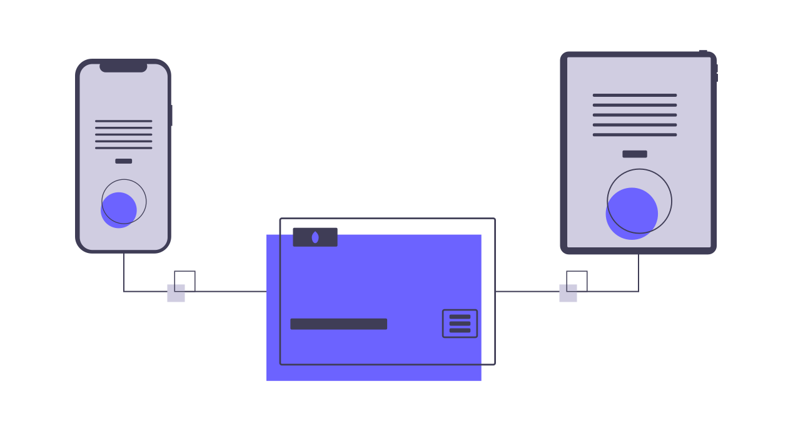
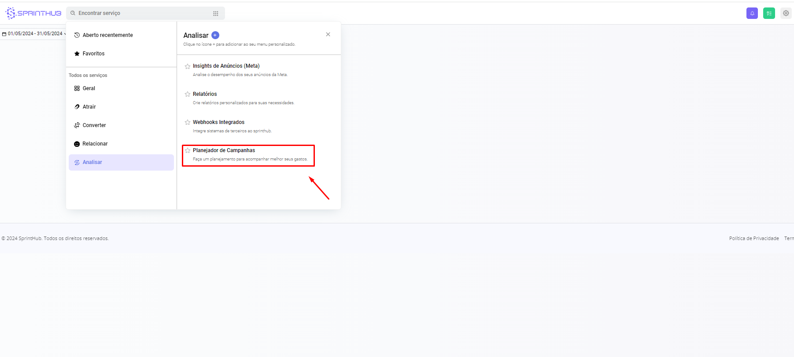
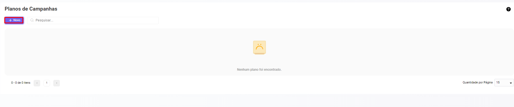
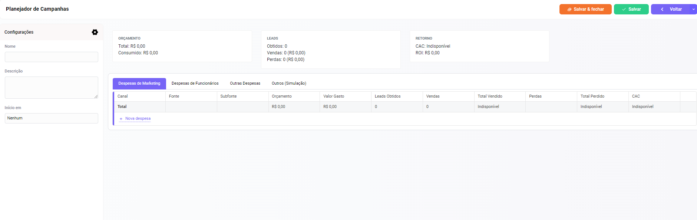
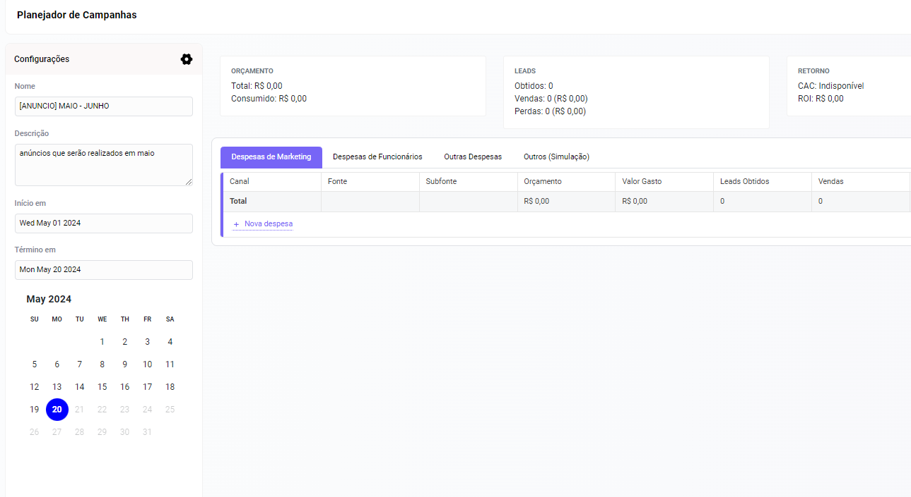
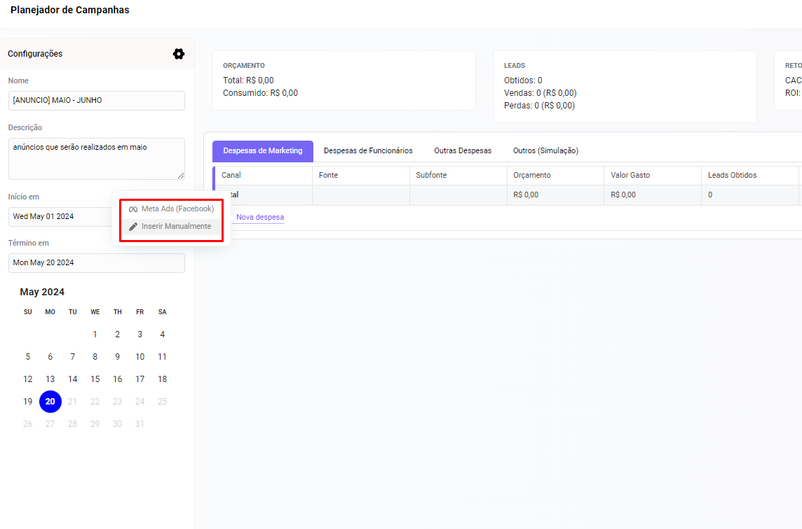
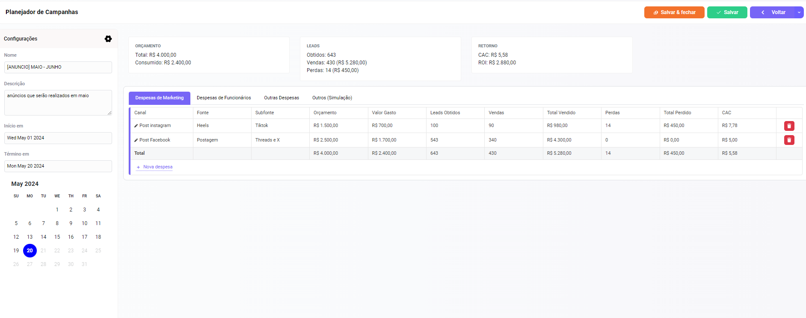
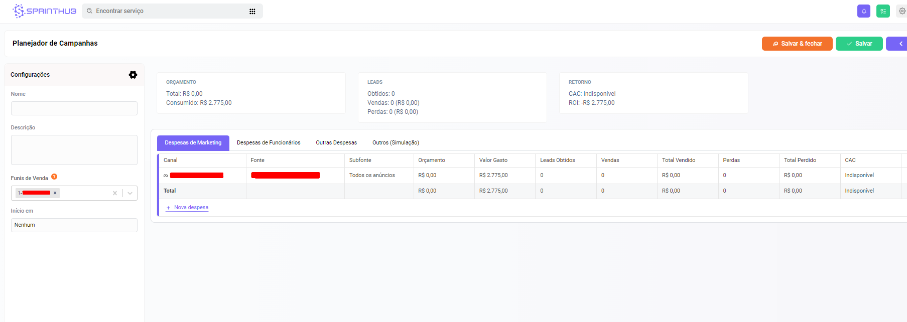

# Planejador de campanha

<figure><figcaption></figcaption></figure>

### O que é o Planejador de Campanhas?

O Planejador de Campanhas da SprintHub é uma solução  que permite que você crie, gerencie e analise suas campanhas de marketing de maneira integrada. Com ele, você pode definir objetivos, segmentar seu público, acompanhar o desempenho e ajustar suas estratégias conforme necessário.

### Passo a passo de como criar o seu planejador de campanha

Dentro do quadro de sistemas, em "Analisar" encontramos o módulo de "Planejador de campanha".

<figure><figcaption></figcaption></figure>

Ao Abrir ele pela primeira vez, não vai ter nenhuma campanha criada. Então vamos em novo

<figure><figcaption></figcaption></figure>

Após clicar em novo, sistema te entrega um quadro quase que em branco.

<figure><figcaption></figcaption></figure>

Definindo o nome, descrição e as data de ínicio e termíno, podemos então definir o que exatamente no nosso planejador. vamos em inserir manualmente primeiramente.

<figure><figcaption></figcaption></figure>

Foi realizado o seguinte exemplo a baixo:

1. Nome do anúncio: você pode definir para se localizar melhor, "post insta", ou "01-05-24-TikTok" e etc.
2. Fonte e subfonte: Onde aquele anúncio foi hospedado, em qual rede social e qual é a rede secundária.
3. Orçamento e valor gasto: Quanto foi estipulado e quanto foi gasto.
4. Leads obtidos e vendas: Você consegue formalizar de forma manual quantos leads entraram na sua campanha e quanto foi vendido.
5. Total vendido: perdas, total perdido: Para criar uma métrica de ganhos e perdidos.
6. CAC: Qual foi o retorno do investimento.

<figure><figcaption></figcaption></figure>

<figure><figcaption></figcaption></figure>

Abaixo temos um exemplo de uma conta de anúncios do Meta, se configurado no anúncio o SprintHub consegue puxar essas informações pela integração com o meta.

<figure><figcaption></figcaption></figure>

### Conclusão

O Planejador de Campanhas da SprintHub é uma ferramenta essencial para qualquer profissional de marketing que deseja maximizar a eficiência e o impacto de suas campanhas. Ao utilizar essa ferramenta, você pode garantir que suas campanhas sejam bem organizadas, direcionadas ao público certo e monitoradas em tempo real para ajustes rápidos e eficazes. Se precisar de assistência ou tiver dúvidas, nossa equipe de suporte está sempre disponível para ajudar.
